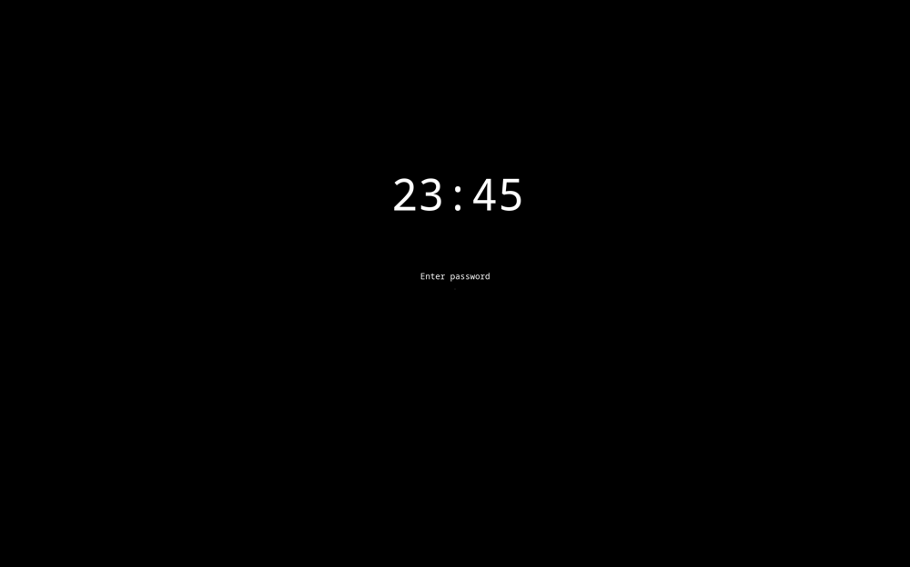

# Lockguy
A simple lockscreen for Linux written in C.

## Features
- Screen inactivity handling
- Full screen obstruction (notifications won't leak through)
- Mock window mode for testing

Customization (maybe) in the future.
